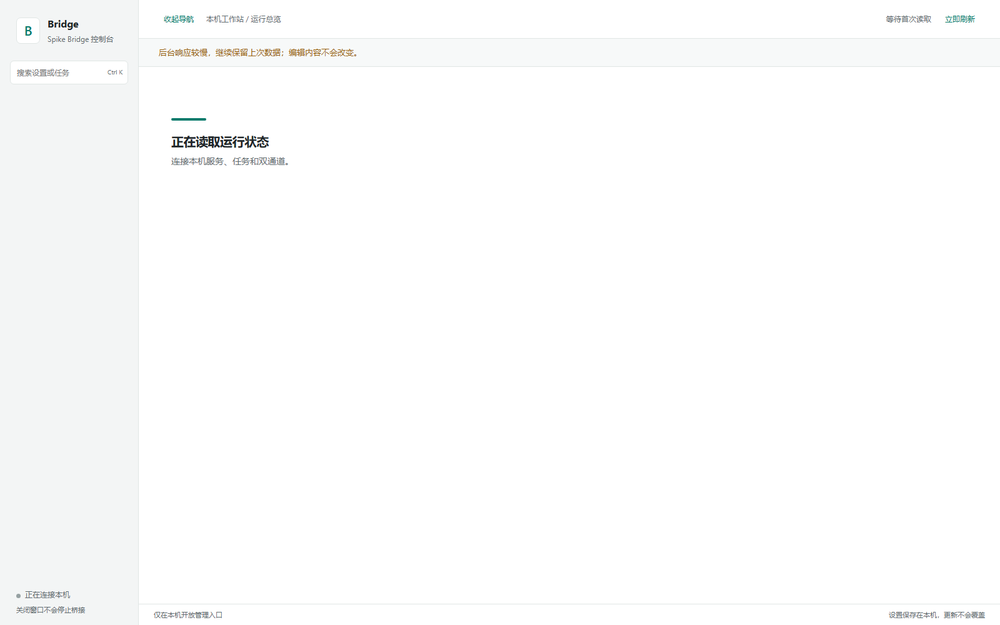
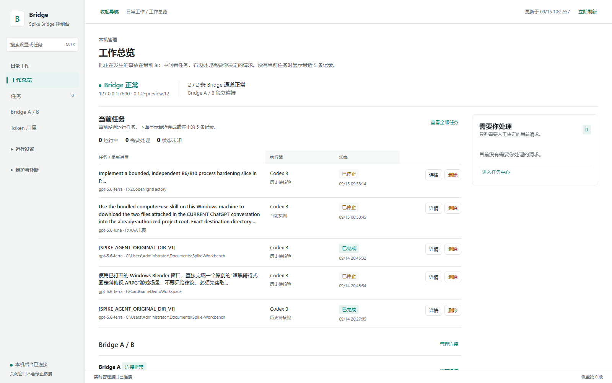
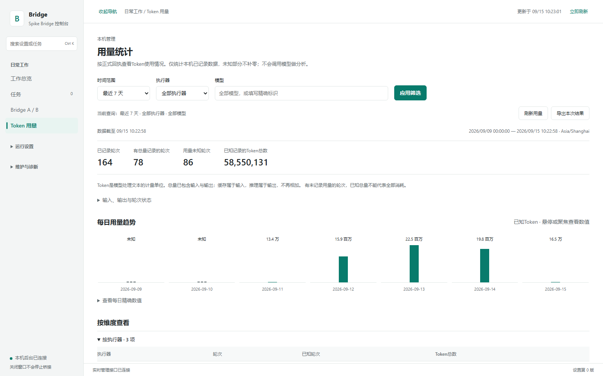
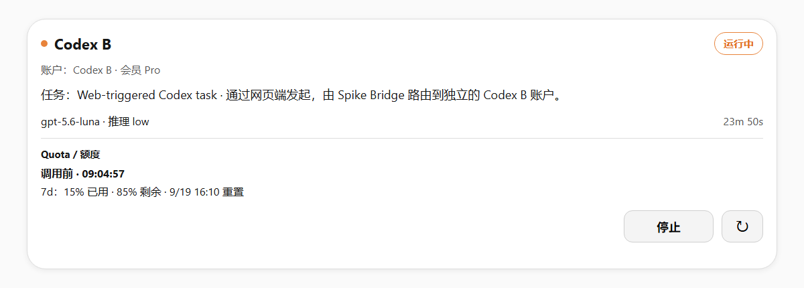

# Spike Bridge

<p align="center">
  <strong>Local-first MCP multi-agent workbench for Codex — visual control, dual accounts, quota visibility, Memory and token analytics.</strong><br>
  <strong>面向 Codex 的本地优先 MCP 多 Agent 工作台 —— 可视化控制、双账户、额度可观测、长期 Memory 与 Token 统计。</strong>
</p>

<p align="center">
  <a href="https://github.com/refer55555-afk/SpikeBridge/releases"></a>
  
  
  
  
</p>

Spike Bridge turns a local Codex / MCP setup into a **persistent visual control plane** instead of another CLI wrapper. It brings two isolated Codex accounts, optional ZCode and Mac Worker providers, task control, approvals, quota cards, Experience Memory, usage analytics, diagnostics and Safe-Boot into one local system.

Spike Bridge 把本机 Codex / MCP 从“命令行调用工具”变成一个可以长期打开使用的**可视化控制面**：两个相互隔离的 Codex 账户、可选 ZCode / Mac Worker、任务与审批、额度卡、Experience Memory、Token 用量统计、诊断和 Safe-Boot 都集中在同一个本地系统里。

> **Local-first / 本地优先** — account state, Memory, usage records, task history and local configuration stay on your machine by default. / 账户登录态、Memory、用量记录、任务历史和本机配置默认只保存在你的电脑上。

---

## Highlights / 核心亮点

| Capability | English | 中文 |
| --- | --- | --- |
| **Visual Operator Workbench** | A desktop-style window for tasks, approvals, providers, usage, Memory, diagnostics, recovery and settings. | 带独立窗口的桌面式工作台，统一管理任务、审批、Provider、用量、Memory、诊断、恢复和设置。 |
| **Dual Codex Accounts** | Codex A and Codex B use separate `CODEX_HOME` and login state while sharing the same Bridge and control plane. | Codex A / B 使用独立 `CODEX_HOME` 与登录态，但同时接入同一个 Bridge 和工作台。 |
| **Web-triggered Quota Card** | Web-triggered Codex tasks can surface account lane, plan tier, model, reasoning level, status, elapsed time and quota/reset information when the provider exposes it. | 网页端发起 Codex 后，可在卡片中看到通道、会员等级、模型、推理等级、状态、运行时间以及额度 / 重置时间（以 Provider 实际回执为准）。 |
| **Experience Memory** | Persistent local Memory with Agent / Project / Tool scope isolation, evidence, redaction and housekeeping. | 真实持久化 Experience Memory，支持 Agent / 项目 / 工具分层隔离、Evidence、脱敏与自动清理。 |
| **Token Usage Analytics** | Track known usage receipts, daily trends and provider/model/project breakdowns without turning unknown values into fake zeroes. | 统计正式 usage 回执、每日趋势及执行器 / 模型 / 项目维度；未知值保持未知，不伪装成 0。 |
| **Remote Mac Worker** | Pair a second Mac over LAN as a bounded worker that receives tasks and returns results without exposing a general-purpose remote shell. | 可把第二台 Mac 通过局域网接入为受限 Worker，接收任务并返回结果，不暴露通用远程 Shell。 |
| **Safe-Boot + LKG** | Verify candidates before promotion and retain a Last Known Good release for recovery. | 候选版本先验证再切换，并保留 Last Known Good，用于故障恢复。 |

---

## Screenshots / 界面截图

> Screenshots below use sanitized public labels where local project paths or private task text could appear. The workbench screenshots are captured from the real Operator UI; the quota screenshot is a privacy-safe public example using the same Agent Card fields and visual language.
>
> 以下截图在可能出现本机路径或私人任务内容的位置使用了公开化示例文本。工作台截图来自真实 Operator UI；额度卡为使用同一 Agent Card 字段与视觉语言生成的隐私安全公开示例。

### Operator Workbench / 工作台总览

The Operator keeps the live Bridge, tasks, approvals and channels in one window. You can see what is running, what needs human attention, which provider owns the task and whether Bridge A / B are connected.

Operator 把 Bridge、当前任务、人工审批和通道状态集中在一个窗口里。你可以直接看到谁在运行、什么需要处理、任务属于哪个执行器，以及 Bridge A / B 是否连接正常。



### Experience Memory / 长期经验记忆

This is a real persistent Experience Memory surface, not a static settings page. It reads the live local Memory store, exposes Core / Evidence counts, supports scope isolation by Agent / Project / Tool, and keeps redaction / housekeeping rules close to the data they protect.

这是真实持久化的 Experience Memory，而不是静态设置页。它直接读取本机 Memory 存储，展示 Core / Evidence 规模，支持按 Agent / 项目 / 工具隔离，并把脱敏、清理和保护规则放在 Memory 生命周期里。



**Memory highlights / Memory 重点**

- Persistent local Experience Memory / 本机长期持久化经验记忆
- Agent / Project / Tool scope isolation / Agent / 项目 / 工具分层隔离
- Core records + Evidence visibility / Core 记录与 Evidence 可观测
- Sensitive-data redaction before write / 敏感信息写入前脱敏
- Housekeeping and protected scopes / 自动清理与保护区

### Token Usage Analytics / Token 用量统计

The Operator records usage **only when there is a reliable receipt**. It separates total, input, cached input, output and reasoning output tokens; provides 1 / 7 / 30 / 90 day windows; and can break usage down by provider, model and project with task-level records and JSON export.

Operator **只在存在可靠回执时记录用量**。统计可区分总 Token、输入、缓存输入、输出与推理输出，支持最近 1 / 7 / 30 / 90 天，以及按执行器、模型、项目拆分，并提供任务级明细与 JSON 导出。



**Important / 重要原则:** missing usage is `UNKNOWN`, not `0`. / 没有可靠回执的用量保持 `UNKNOWN`，不会被伪造为 `0`。

### Web-triggered Codex Quota Card / 网页端 Codex 额度卡

When a supported web / MCP host starts a Codex task through Spike Bridge, the mounted Agent Card can make the execution lane observable instead of leaving you with an anonymous spinner. When quota metadata is available, the same card can show the Codex account slot, plan tier, model, reasoning level, running state, elapsed time, used / remaining quota and reset time.

当支持的网页 / MCP Host 通过 Spike Bridge 发起 Codex 任务时，Agent Card 可以把“到底是谁在跑”直接展示出来，而不是只留下一个匿名的加载状态。Provider 提供额度元数据时，同一张卡可以显示 Codex 账户通道、会员等级、模型、推理等级、运行状态、已运行时间、额度已用 / 剩余比例以及重置时间。



This is especially useful with **Codex A + Codex B**, because the visible card makes account routing and quota state much easier to verify before launching more work.

这对 **Codex A + Codex B 双账户**尤其有价值：在继续派发任务之前，你可以先确认当前到底使用哪个账户、额度还剩多少。

---

## Architecture / 架构

```text
                 ChatGPT / Web MCP Host
                          │
                  optional tunnel
                          │
                          ▼
              ┌─────────────────────┐
              │     Spike Bridge    │
              │  127.0.0.1:7690    │
              └──────────┬──────────┘
                         │
        ┌────────────────┼──────────────────┐
        │                │                  │
        ▼                ▼                  ▼
   Codex A          Codex B             ZCode
 isolated home     isolated home        optional
        │                │
        └──────────┬─────┘
                   │
                   ├──────────────► Mac Worker (LAN, optional)
                   │
                   ├──────────────► Experience Memory (local SQLite)
                   ├──────────────► Usage Ledger / Token Analytics
                   └──────────────► Safe-Boot / Last Known Good

              ┌─────────────────────┐
              │  Operator Workbench │
              │  127.0.0.1:7692    │
              └─────────────────────┘
```

The MCP service and Operator bind to loopback by default. Remote ChatGPT access is an **optional external tunnel layer**, not an excuse to expose the local control plane directly.

MCP 服务和 Operator 默认只绑定 loopback。远程 ChatGPT 接入属于**可选的外部 Tunnel 层**，并不意味着要把本地控制面直接暴露到公网。

---

## Quick Start / 快速开始

### Requirements / 前置条件

- Windows 10 / 11
- Node.js 22+
- A usable `codex.exe` from Codex Desktop or Codex CLI / 可用的 Codex Desktop 或 Codex CLI `codex.exe`
- Microsoft Edge for the standalone Operator window / Microsoft Edge（用于独立工作台窗口）

### Install / 安装

```powershell
git clone https://github.com/refer55555-afk/SpikeBridge.git
cd SpikeBridge
npm run setup
```

The setup flow checks Node and Codex, installs dependencies, creates local configuration, prepares an isolated Codex A account home, guides login, creates the first Safe-Boot LKG and installs the Operator launcher.

安装流程会检查 Node 与 Codex、安装依赖、生成本地配置、创建隔离的 Codex A 账户目录、引导登录、建立首个 Safe-Boot LKG，并安装工作台启动入口。

Open the workbench / 打开工作台：

```powershell
npm run panel
```

or / 或：

```cmd
START-SPIKE-BRIDGE.cmd panel
```

Health check / 健康检查：

```powershell
Invoke-RestMethod http://127.0.0.1:7690/healthz
```

---

## Dual Codex Accounts / 双 Codex 账户

Codex A and Codex B are intentionally isolated. They do **not** share auth state; each account uses its own `CODEX_HOME`, while the Bridge presents both as separate providers in the same task/control surface.

Codex A 和 Codex B 刻意保持隔离：它们**不会共享登录态**，各自使用独立 `CODEX_HOME`，但会作为两个独立 Provider 同时出现在同一个任务 / 控制面中。

Configure Codex B / 配置 Codex B：

```powershell
powershell -NoProfile -ExecutionPolicy Bypass -File .\bootstrap\setup.ps1 `
  -ConfigureSecondAccount -SkipDependencies -SkipStart -SkipPanel
```

Then restart / 完成第二次登录后重启：

```cmd
START-SPIKE-BRIDGE.cmd restart
```

---

## Remote Mac Worker / 第二台电脑 Worker

A second Mac can be paired over LAN as a bounded worker. The Windows host owns the Bridge and task control; the Mac receives paired tasks and returns status/results. The worker exposes only its bounded health/task surface instead of a general-purpose remote shell.

可以把第二台 Mac 通过局域网配对为受限 Worker。Windows 主机负责 Bridge 与任务控制，Mac 接收经过配对的任务并返回状态 / 结果；Worker 只暴露受限的健康与任务接口，而不是通用远程 Shell。

See / 详见：[`bootstrap/mac-worker-b/README.md`](bootstrap/mac-worker-b/README.md)

---

## Remote ChatGPT / Tunnel

Spike Bridge itself listens on `127.0.0.1`. If a remote ChatGPT / web client must reach the MCP endpoint, you need your own compatible tunnel / Fast Entry client and control-plane entitlement. This repository does **not** ship private tunnel binaries, Tunnel IDs, organization IDs or credentials.

Spike Bridge 本体只监听 `127.0.0.1`。如果远程 ChatGPT / 网页端需要访问 MCP，需要你自行配置兼容的 Tunnel / Fast Entry 客户端和控制平面权限。本仓库**不会**分发私人 Tunnel 二进制、Tunnel ID、组织 ID 或凭据。

See / 详见：[`docs/TUNNEL_SETUP.md`](docs/TUNNEL_SETUP.md)

---

## Configuration / 配置

Full guide / 完整说明：[`docs/CONFIGURATION.md`](docs/CONFIGURATION.md)

| Local file / 本地文件 | Purpose / 用途 | Git |
| --- | --- | --- |
| `config/local.json` | Local `codex.exe` path / 本机 Codex 路径 | ignored |
| `config/operator.json` | Operator settings / 工作台设置 | ignored |
| `config/codex-call-profile.md` | Codex call / approval policy / Codex 调用与审批规则 | ignored |
| `config/context.json` | Optional local structured context / 可选本地结构化上下文 | ignored |
| `accounts/` | Codex login state / Codex 登录态 | ignored |
| `data/`, runtime `state/`, `logs/` | Memory, usage, tasks, runtime data / Memory、用量、任务与运行数据 | ignored |

Only public `*.example.*` files and seed runtime sources belong in the repository. / 仓库只保留公开的 `*.example.*` 示例和 seed runtime 源码。

### Local context / 本地上下文

`spike_context` reads `config/context.json`. The public default is empty and contains no author data. / `spike_context` 读取 `config/context.json`；公开版默认为空，不包含作者私人数据。

```json
{
  "schemaVersion": 1,
  "items": []
}
```

---

## Commands / 常用命令

```powershell
npm run setup          # first-time setup / 首次配置
npm run panel          # open Operator / 打开工作台
npm test               # model-free regression suite / 非模型回归
npm run audit:public   # privacy & secret scan / 隐私与密钥扫描
node scripts/memory.mjs status
node scripts/retention.mjs --dry-run
```

```cmd
START-SPIKE-BRIDGE.cmd          REM start/resume LKG / 启动或恢复 LKG
START-SPIKE-BRIDGE.cmd status   REM status / 查看状态
START-SPIKE-BRIDGE.cmd restart  REM safe restart / 安全重启
START-SPIKE-BRIDGE.cmd cutover  REM verify + promote candidate / 验证并切换候选
```

---

## Security & Privacy / 安全与隐私

- MCP binds to loopback by default. / MCP 默认只绑定 loopback。
- Operator defaults to `127.0.0.1:7692` with a random local session token. / 工作台默认绑定 `127.0.0.1:7692`，使用本机随机会话 Token。
- Codex A / B authentication remains isolated in local account homes. / Codex A / B 登录态保存在相互隔离的本地账户目录。
- Memory, usage records, task history, tunnel config and secrets are runtime-local data. / Memory、用量、任务历史、Tunnel 配置和密钥都属于本地运行数据。
- Mac Worker pairing does not expose a general remote shell. / Mac Worker 配对不会暴露通用远程 Shell。
- Unknown usage remains unknown. / 未知用量保持未知，不补零、不猜测。
- Before publishing changes, run `npm run audit:public`. / 公开提交前运行 `npm run audit:public`。

Do not commit generated `accounts/`, `secrets/`, `config/local.json`, `config/context.json`, runtime `data/`, runtime `state/` or logs. / 不要提交这些运行时文件。

More / 更多：[`SECURITY.md`](SECURITY.md) · [`docs/PRIVACY.md`](docs/PRIVACY.md)

---

## Source & License / 来源与许可证

Spike Bridge contains modified runtime portions derived from the Apache-2.0 licensed Codexless project. Attribution and third-party notices are documented in [`THIRD_PARTY_NOTICES.md`](THIRD_PARTY_NOTICES.md).

Spike Bridge 的运行时包含基于 Apache-2.0 许可的 Codexless 项目修改部分；来源与第三方声明见 [`THIRD_PARTY_NOTICES.md`](THIRD_PARTY_NOTICES.md)。

This repository is licensed under **Apache License 2.0**. See [`LICENSE`](LICENSE).

本仓库使用 **Apache License 2.0**。

> Spike Bridge is an independent open-source project and is not an official OpenAI product. / Spike Bridge 是独立开源项目，并非 OpenAI 官方产品。
